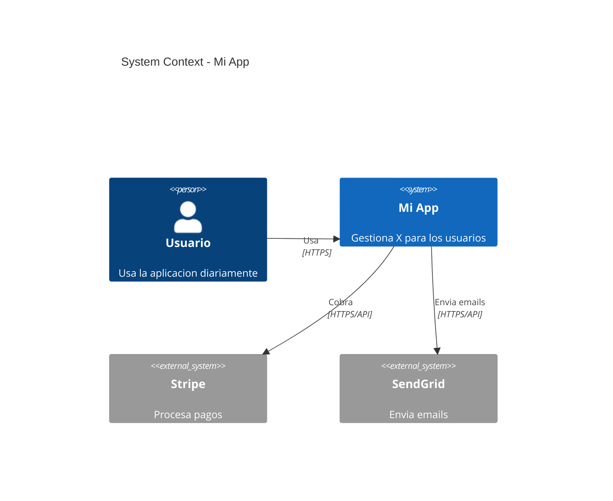
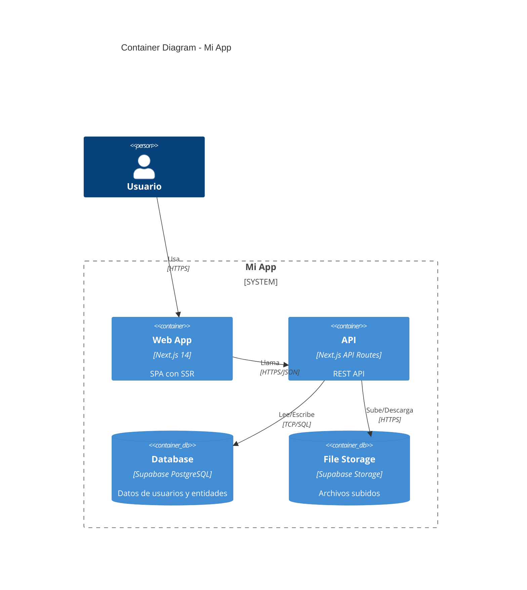
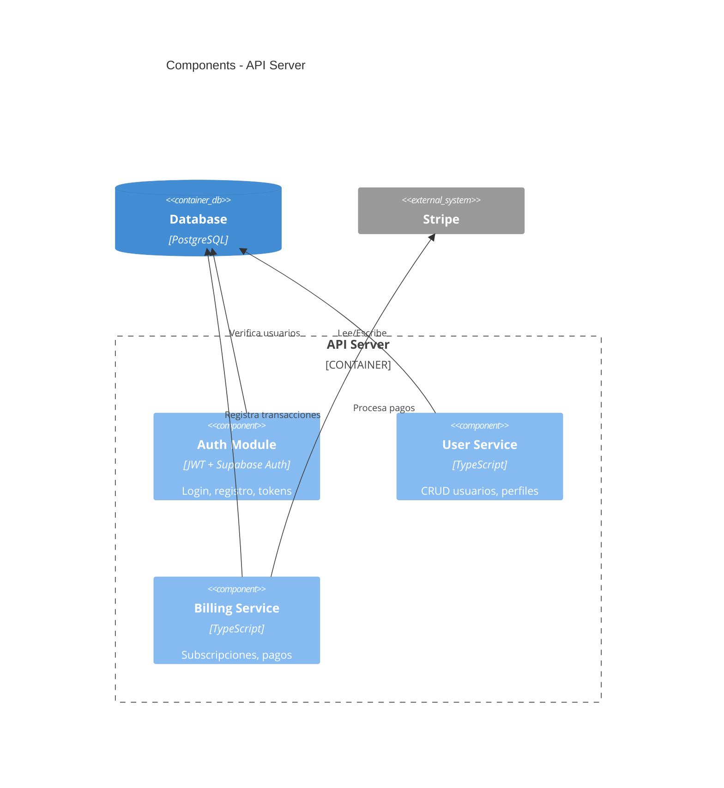
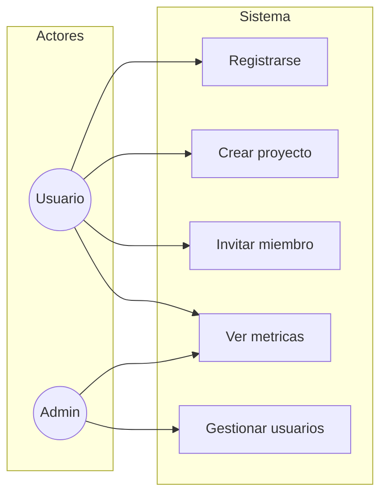
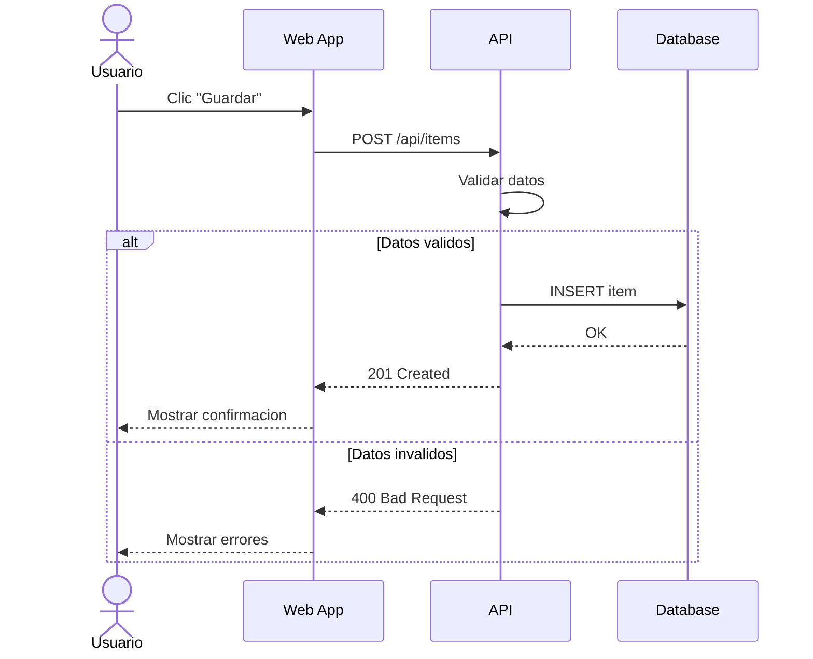
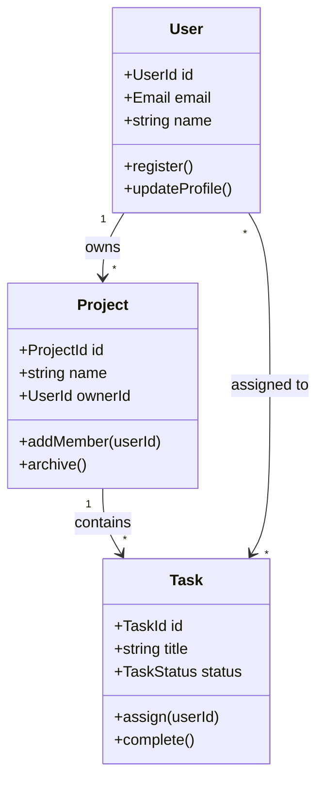
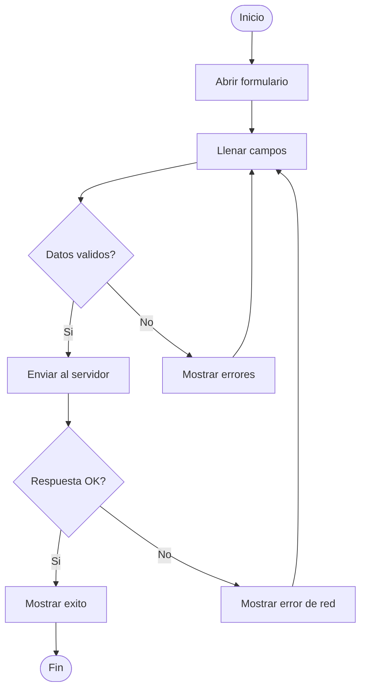
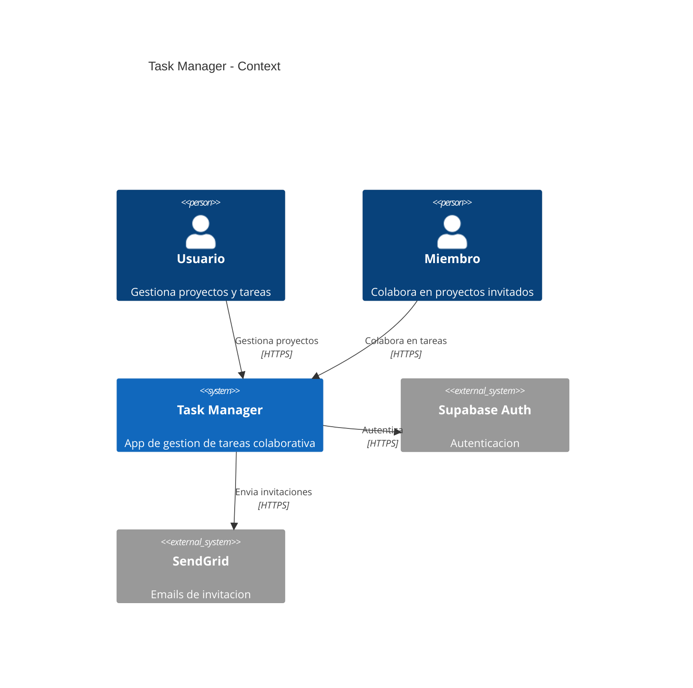

# Design-First Guide

Guia de referencia permanente para la Fase 0: Diseno. Consultar antes de generar codigo.

---

## 1. Por que Design-First

Disenar antes de codificar reduce retrabajo, alinea expectativas y produce codigo mas limpio desde el inicio.

**Sin diseno:**
```
Idea -> Codigo -> "ah, esto no escala" -> Reescribir -> "le falta esto" -> Parchar
```

**Con diseno:**
```
Idea -> SPEC -> Diagramas C4 -> Modelo de dominio -> Flujos -> Codigo informado
```

**ROI concreto:**
- Las decisiones de arquitectura tomadas despues de empezar a codificar cuestan 5-10x mas de corregir
- Edge cases descubiertos en diseno = 1 linea en un documento. Descubiertos en produccion = un hotfix urgente
- Un glosario compartido elimina ambiguedades entre SPEC, codigo y comunicacion

**Cuando saltar el diseno:**
- Prototipos desechables (< 1 dia de trabajo)
- Scripts de una sola ejecucion
- Fixes puntuales en codigo existente

---

## 2. C4 Model Quick Reference

El modelo C4 organiza la arquitectura en 4 niveles de zoom.

### Level 1: System Context

**Que muestra:** El sistema como caja negra, rodeado de actores y sistemas externos.
**Cuando:** SIEMPRE. Es el primer diagrama que se crea.



### Level 2: Container Diagram

**Que muestra:** Los contenedores tecnicos dentro del sistema (apps, DBs, caches, queues).
**Cuando:** SIEMPRE. Define las decisiones tecnologicas.



### Level 3: Component Diagram

**Que muestra:** Modulos internos de un contenedor complejo.
**Cuando:** Solo si un contenedor tiene >= 3 modulos con responsabilidades distintas.



### Level 4: Code

**No se diagrama manualmente.** Se genera automaticamente del codigo (con herramientas como tsdoc, pydoc, etc.).

---

## 3. UML Esenciales

Solo 4 diagramas UML son utiles en la practica para un MVP. Todos en Mermaid.

### Use Case Diagram

Muestra QUE hace el sistema desde la perspectiva del actor.



### Sequence Diagram

Muestra COMO interactuan los componentes en un flujo.



### Class Diagram

Muestra las entidades del dominio y sus relaciones.



### Activity Diagram (Flowchart)

Muestra el flujo de acciones con decisiones.



---

## 4. User Flows + Edge Cases

### Tecnica de 5 Preguntas

Para CADA flujo critico del usuario, responder estas 5 preguntas ANTES de implementar:

| # | Pregunta | Ejemplo de respuesta |
|---|----------|---------------------|
| 1 | **Datos vacios?** Primera vez, sin resultados | Mostrar ilustracion + CTA "Crea tu primer X" |
| 2 | **Error de red?** Timeout, 500, offline | Toast con "Reintentar", retry automatico x3 |
| 3 | **Sin permisos?** Rol incorrecto, token expirado | Redirect a login si token expirado, 403 si rol |
| 4 | **Datos invalidos?** Formato erroneo, limites | Validacion inline en blur, mensaje por campo |
| 5 | **Interrupcion?** Cierra pestana, pierde conexion | Auto-save draft cada 30s, confirmar si hay cambios |

### Ejemplo completo

**Flujo: Crear Proyecto**

```mermaid
flowchart TD
    START([Dashboard]) --> NEW[Clic "Nuevo Proyecto"]
    NEW --> FORM[Mostrar formulario]
    FORM --> FILL[Llenar nombre + descripcion]
    FILL --> SUBMIT[Clic "Crear"]
    SUBMIT --> VALID{Datos validos?}
    VALID -->|No| ERRORS[Mostrar errores inline]
    ERRORS --> FILL
    VALID -->|Si| API{API responde?}
    API -->|Si| SUCCESS[Redirect a proyecto creado]
    API -->|No| RETRY[Toast: Error de red + Reintentar]
    RETRY --> SUBMIT
    SUCCESS --> END([Proyecto creado])
```

**Edge cases:**
1. **Vacio**: Dashboard muestra "No tienes proyectos. Crea el primero!" con boton
2. **Red**: Toast con retry manual. Datos del formulario no se pierden
3. **Permisos**: Solo usuarios con plan activo pueden crear. Free muestra upgrade CTA
4. **Invalido**: Nombre obligatorio (min 3 chars), descripcion opcional (max 500)
5. **Interrupcion**: Si hay datos en el form y navega fuera, confirmar "Tienes cambios sin guardar"

---

## 5. ADR Guide

### Cuando crear un ADR

- Elegir framework/libreria (React vs Vue, PostgreSQL vs MongoDB)
- Decidir patron arquitectonico (monolito vs microservicios)
- Elegir estrategia de auth (JWT vs sessions, propio vs third-party)
- Decidir sobre hosting/infra (Vercel vs AWS vs self-hosted)
- Cualquier decision que seria costosa (> 1 dia) de revertir

### Cuando NO crear un ADR

- Elegir un nombre de variable
- Decidir entre let y const
- Formateo de codigo (eso lo decide el linter)
- Decisiones facilmente reversibles (< 1 hora de cambio)

### Formato

Usar `.claude/templates/design/adr-template.md` con formato Nygard:
1. **Titulo**: ADR-NNN: Verbo + sustantivo (ej: "Usar Supabase como BaaS")
2. **Estado**: Propuesto -> Aceptado (despues de validacion)
3. **Contexto**: Situacion actual y restricciones
4. **Decision**: Que se decidio y por que
5. **Alternativas**: Tabla comparativa con criterios
6. **Consecuencias**: Positivas, negativas, riesgos con mitigacion

### Ejemplo real

**ADR-001: Usar Supabase como Backend-as-a-Service**

- **Contexto**: MVP necesita auth, DB y storage. Equipo de 1 persona. Tiempo limitado.
- **Decision**: Supabase porque integra PostgreSQL + Auth + Storage + Realtime en un servicio.
- **Alternativas**: Firebase (NoSQL, vendor lock-in), custom (mas control, mas tiempo), Appwrite (menos maduro).
- **Consecuencias**: (+) rapido de implementar, Row Level Security. (-) dependencia de servicio externo.

---

## 6. DDD Cheat Sheet

### Conceptos clave

| Concepto | Que es | Ejemplo |
|----------|--------|---------|
| **Bounded Context** | Limite donde un modelo es consistente | "OrderContext", "UserContext" |
| **Aggregate** | Grupo de objetos que cambian juntos | Order + OrderItems |
| **Aggregate Root** | Punto de entrada al agregado | Order (no se accede a OrderItem directamente) |
| **Entity** | Objeto con identidad unica | User (tiene userId) |
| **Value Object** | Objeto sin identidad, inmutable | Email, Money, Address |
| **Domain Event** | Algo que ocurrio en el dominio | OrderCreated, PaymentProcessed |
| **Repository** | Acceso a datos del agregado | OrderRepository.findById() |

### Reglas practicas

1. **Agregados pequenos**: Si tiene > 5 entidades internas, dividir
2. **Value Objects desde el dia 1**: Email, Money, DateRange. Centralizan validacion
3. **Un agregado = una transaccion**: No modificar dos agregados en la misma transaccion
4. **Repositories solo para Aggregate Roots**: No para entidades internas
5. **Domain Events en pasado**: "OrderCreated", no "CreateOrder"

### Mapeo a codigo

```
Bounded Context  ->  Modulo/carpeta (src/order/, src/user/)
Aggregate Root   ->  Clase principal con metodos de negocio
Entity           ->  Clase con id, dentro del agregado
Value Object     ->  Clase inmutable, comparacion por valor
Domain Event     ->  Tipo/interfaz emitido despues de una accion
Repository       ->  Interfaz en domain/, implementacion en infra/
```

---

## 7. Event Storming Light

Version simplificada de Event Storming para proyectos individuales.

### Proceso (15-30 min)

1. **Listar eventos del dominio** en pasado: "UsuarioRegistrado", "ProyectoCreado", "TareaCompletada"
2. **Ordenar cronologicamente**: Del primero al ultimo en el flujo tipico
3. **Identificar comandos** que causan cada evento: "Registrarse" -> "UsuarioRegistrado"
4. **Identificar actores**: Quien ejecuta cada comando
5. **Agrupar en bounded contexts**: Eventos relacionados = mismo contexto

### Template

```
Actor          -> Comando           -> Evento               -> Contexto
---
Usuario        -> Registrarse       -> UsuarioRegistrado     -> Identity
Usuario        -> Crear proyecto    -> ProyectoCreado        -> Project
Usuario        -> Invitar miembro   -> MiembroInvitado       -> Project
Miembro        -> Aceptar invitacion-> InvitacionAceptada    -> Project
Usuario        -> Crear tarea       -> TareaCreada           -> Task
Asignado       -> Completar tarea   -> TareaCompletada       -> Task
Sistema        -> Notificar         -> NotificacionEnviada   -> Notification
```

---

## 8. Workflow Completo

```
/project:interview <nombre>
        |
        v
   SPEC.md (especificacion completa)
        |
        v
/design:full <nombre>
        |
        +--> [1] /design:architecture
        |         C4 Context + Containers + ADRs
        |         (usuario valida)
        |
        +--> [2] /design:domain
        |         Bounded Contexts + Aggregates + Glosario
        |         (usuario valida)
        |
        +--> [3] /design:flows
        |         User Flows + Edge Cases + Sequences
        |         (usuario valida)
        |
        +--> [4] /design:validate
        |         Checklist de completitud
        |
        v
   DESIGN/ (artefactos completos)
        |
        v
/project:mvp <nombre>
        |
        v
   Codigo informado por el diseno
```

### Gates entre fases

| Gate | Condicion | Si no pasa |
|------|-----------|------------|
| SPEC -> Design | SPEC.md existe con secciones requeridas | Ejecutar `/project:interview` |
| Design -> Code | VALIDATION-CHECKLIST.md todo marcado | Completar artefactos faltantes |
| Architecture -> Domain | C4 containers definidos | Completar `/design:architecture` |
| Domain -> Flows | Bounded contexts + glosario | Completar `/design:domain` |

---

## 9. Comandos Disponibles

| Comando | Input | Output | Descripcion |
|---------|-------|--------|-------------|
| `/design:architecture` | SPEC.md | C4 + ADRs | Genera diagramas C4 y ADRs |
| `/design:domain` | SPEC + C4 | DDD + Class diagram | Modela el dominio |
| `/design:flows` | SPEC + C4 + Domain | Flows + Sequences | Disena flujos de usuario |
| `/design:validate` | designs/ | Checklist | Verifica completitud |
| `/design:full` | SPEC.md | Todo lo anterior | Flujo completo orquestado |

### Ejecucion individual vs full

- **`/design:full`**: Para proyectos nuevos. Ejecuta todo en orden con pausas.
- **Comandos individuales**: Para iterar sobre un area especifica despues de feedback.

---

## 10. Checklist Pre-Codigo

Antes de ejecutar `/project:mvp`, verificar:

### Obligatorios

- [ ] C4 Context: actores y sistemas externos identificados
- [ ] C4 Containers: cada contenedor con tecnologia asignada
- [ ] UML Use Cases: cubren requisitos del SPEC
- [ ] Al menos 1 diagrama de secuencia para flujo critico
- [ ] User Flows: happy path + edge cases por flujo
- [ ] Bounded Contexts definidos
- [ ] Aggregates identificados
- [ ] Glosario con >= 10 terminos
- [ ] Al menos 1 ADR por decision tecnologica
- [ ] Nombres consistentes entre todos los artefactos
- [ ] DESIGN-SUMMARY.md con links a todo

### Recomendados

- [ ] C4 Components para contenedores complejos
- [ ] Class diagram completo con relaciones
- [ ] Event Storming Light documentado
- [ ] Edge cases mapeados a componentes UI

---

## 11. Ejemplo Aplicado: Task Manager

Ejemplo simplificado aplicando todo el framework a una app de gestion de tareas.

### SPEC (resumen)

App web para gestionar proyectos y tareas. Usuarios pueden crear proyectos, invitar miembros, crear tareas, asignarlas y completarlas. Stack: Next.js + Supabase.

### C4 Context



### Bounded Contexts

```
1. Identity Context     -> Registro, login, perfiles
2. Project Context      -> Proyectos, membresías, invitaciones
3. Task Context         -> Tareas, asignaciones, estados
4. Notification Context -> Emails, notificaciones in-app
```

### Glosario (extracto)

| Termino | Definicion | Contexto |
|---------|-----------|----------|
| Project | Contenedor de tareas con miembros | Project |
| Task | Unidad de trabajo asignable | Task |
| Member | Usuario con acceso a un proyecto | Project |
| Owner | Creador y administrador de un proyecto | Project |
| Assignment | Relacion entre un miembro y una tarea | Task |

### ADR-001: Usar Supabase como BaaS

- **Contexto**: MVP individual, necesita auth + DB + realtime
- **Decision**: Supabase (PostgreSQL + Auth + RLS + Realtime)
- **Alternativas**: Firebase (NoSQL), Custom (mas tiempo), PlanetScale (solo DB)
- **Consecuencias**: (+) rapido, RLS, realtime gratis. (-) dependencia externa

### Edge Case: Crear Tarea

| Escenario | Respuesta |
|-----------|-----------|
| Empty state | "No hay tareas. Crea la primera!" + CTA |
| Network error | Toast "Error de conexion" + retry |
| Sin permisos | Solo Owner y miembros pueden crear. Otros ven 403 |
| Datos invalidos | Titulo obligatorio (3-100 chars), validacion inline |
| Interrupcion | Draft auto-guardado en localStorage |

---

## Referencias Externas

- [C4 Model](https://c4model.com/) - Simon Brown
- [Mermaid C4 Syntax](https://mermaid.js.org/syntax/c4.html)
- [ADR GitHub Org](https://adr.github.io/) - Nygard format
- [DDD Reference](https://www.domainlanguage.com/ddd/reference/) - Eric Evans
- [Event Storming](https://www.eventstorming.com/) - Alberto Brandolini
