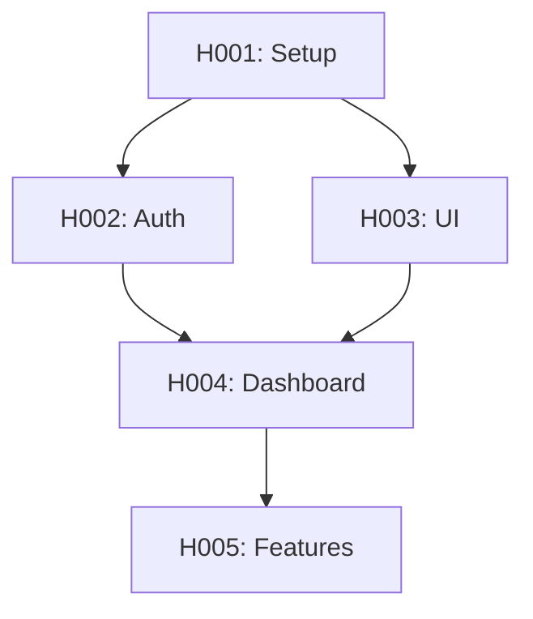

# /stories:auto - Generación Automática de Historias con IA

Genera historias de usuario automáticamente usando la técnica RaT (Refine and
Thought).

## Uso

```
/stories:auto <spec-file>
/stories:auto .claude/specs/SPEC-proyecto.md
```

## Instrucciones para Claude

Cuando el usuario ejecute `/stories:auto <spec>`:

### 1. Leer y Analizar SPEC

Lee el archivo de especificación completo:

```bash
cat <spec-file>
```

Extrae:

- **Objetivo del producto**: ¿Qué problema resuelve?
- **Usuarios objetivo**: ¿Quién lo usará?
- **Features principales**: ¿Qué funcionalidades tiene?
- **Requisitos técnicos**: Stack, integraciones, etc.

### 2. Técnica RaT (Refine and Thought)

Aplica el proceso iterativo:

**Paso 1 - Thought (Pensamiento inicial)**:

```
Dado el SPEC, ¿cuáles son las funcionalidades core que un usuario necesita?
- Listar todas las acciones que un usuario puede realizar
- Identificar flujos principales
- Detectar dependencias entre funcionalidades
```

**Paso 2 - Refine (Refinamiento)**:

```
Para cada funcionalidad identificada:
- ¿Es atómica o puede dividirse?
- ¿Tiene valor independiente para el usuario?
- ¿Cuáles son los criterios de aceptación mínimos?
```

**Paso 3 - Iterate (Iterar)**:

```
Revisar cada historia generada:
- ¿Cumple INVEST? (Independent, Negotiable, Valuable, Estimable, Small, Testable)
- ¿Tiene dependencias circulares?
- ¿El scope es claro?
```

### 3. Generar Historias

Para cada historia identificada, usa el template:

```markdown
---
id: H<XXX>
title: <Título descriptivo>
priority: critical|high|medium|low
depends_on: [H<YYY>]
parallelizable: true|false
estimated_tasks: <número>
tags: [auth, billing, ui, api, etc.]
---

# Historia: <Título>

## Narrativa

**Como** <tipo de usuario> **Quiero** <acción o funcionalidad> **Para**
<beneficio o valor>

## Contexto

<Explicación adicional del por qué esta historia es importante>

## Criterios de Aceptación

1. **Dado** <contexto inicial> **Cuando** <acción del usuario> **Entonces**
   <resultado esperado>

2. **Dado** <otro contexto> **Cuando** <otra acción> **Entonces**
   <otro resultado>

3. [Más criterios según necesidad]

## Fuera de Alcance

- <Lo que NO incluye esta historia>
- <Funcionalidades para futuras iteraciones>

## Notas Técnicas

- Stack sugerido: <tecnologías>
- Integraciones: <APIs, servicios>
- Consideraciones de seguridad: <si aplica>

## Dependencias

- Requiere: [H<YYY> - Nombre de historia]
- Bloquea: [H<ZZZ> - Nombre de historia]

## Estimación

- Complejidad: S|M|L|XL
- Tareas estimadas: <número>
```

### 4. Ordenar por Dependencias

Genera el orden de ejecución:

```
1. H001 - Setup inicial (sin dependencias)
2. H002 - Auth básico (sin dependencias)
   H003 - UI base (sin dependencias)  [paralelo]
3. H004 - Dashboard (depende de H002, H003)
4. H005 - Features avanzadas (depende de H004)
```

### 5. Guardar Historias

Crea archivos en `.claude/stories/`:

```
.claude/stories/
├── H001-setup-inicial.md
├── H002-auth-basico.md
├── H003-ui-base.md
├── H004-dashboard.md
├── H005-features-avanzadas.md
└── STORIES-INDEX.md
```

### 6. Generar Índice

Crea `.claude/stories/STORIES-INDEX.md`:

````markdown
# Índice de Historias

## Resumen

- Total historias: X
- Críticas: Y
- Parallelizables: Z

## Por Prioridad

### Critical

- [ ] H001 - Setup inicial
- [ ] H002 - Auth básico

### High

- [ ] H003 - UI base
- [ ] H004 - Dashboard

### Medium

- [ ] H005 - Features avanzadas

## Grafo de Dependencias


````

## Siguiente Paso

Para dividir en tareas: \`\`\` /tasks:parallel H001 \`\`\`

```

### 7. Output al Usuario

```

═══════════════════════════════════════ HISTORIAS GENERADAS
═══════════════════════════════════════

SPEC analizado: <nombre> Historias creadas: X

CRÍTICAS (hacer primero): H001 - Setup inicial H002 - Auth básico

PARALLELIZABLES: H002, H003 pueden ejecutarse en paralelo

DEPENDENCIAS: H004 requiere H002 + H003 H005 requiere H004

Archivos creados en: .claude/stories/

Siguiente paso: /tasks:parallel H001 o /tasks:graph (ver dependencias)
═══════════════════════════════════════

```

## Configuración Avanzada

### Filtros

```

/stories:auto <spec> --priority=critical /stories:auto <spec> --tag=auth
/stories:auto <spec> --max=5

```

### Regenerar

```

/stories:auto <spec> --regenerate H002

```

## Output Esperado

1. Historias individuales en `.claude/stories/H<XXX>-<nombre>.md`
2. Índice en `.claude/stories/STORIES-INDEX.md`
3. Resumen en consola con próximos pasos
```
