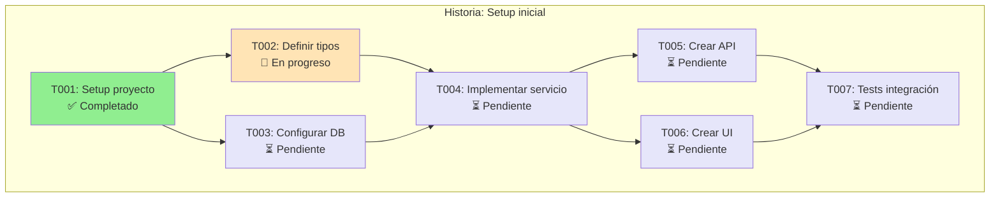

# /tasks:graph - Visualización del Grafo de Dependencias

Visualiza el grafo de dependencias de todas las tareas del proyecto.

## Uso

```
/tasks:graph
/tasks:graph --story H001
/tasks:graph --format mermaid
/tasks:graph --show-status
```

## Instrucciones para Claude

Cuando el usuario ejecute `/tasks:graph`:

### 1. Leer Todas las Tareas

```bash
# Listar todas las tareas
ls .claude/tasks/*.md

# Leer frontmatter de cada una
for file in .claude/tasks/T*.md; do
  head -20 "$file"
done
```

Extrae de cada tarea:

- `id`: Identificador
- `depends_on`: Array de dependencias
- `blocks`: Array de tareas bloqueadas
- `status`: pending|in_progress|completed
- `story`: Historia padre

### 2. Construir Grafo

Crea estructura de datos:

```json
{
  "nodes": [
    { "id": "T001", "story": "H001", "status": "completed" },
    { "id": "T002", "story": "H001", "status": "in_progress" },
    { "id": "T003", "story": "H001", "status": "pending" }
  ],
  "edges": [
    { "from": "T001", "to": "T002" },
    { "from": "T001", "to": "T003" },
    { "from": "T002", "to": "T004" },
    { "from": "T003", "to": "T004" }
  ]
}
```

### 3. Detectar Problemas

**Dependencias circulares**:

```
⚠️ CICLO DETECTADO: T002 → T003 → T002
```

**Tareas huérfanas**:

```
⚠️ T005 no tiene dependencias ni es dependencia de otras
```

**Tareas bloqueadas indefinidamente**:

```
⚠️ T004 depende de T003 que está en estado "blocked"
```

### 4. Calcular Camino Crítico

Identifica la ruta más larga:

```
Camino crítico: T001 → T002 → T004 → T006 → T008
Tareas en camino crítico: 5
```

### 5. Generar Visualización

**Formato ASCII** (default):

```
═══════════════════════════════════════════════════════════════
  GRAFO DE DEPENDENCIAS
═══════════════════════════════════════════════════════════════

HISTORIA: H001 - Setup inicial

        T001 [✅]
          │
    ┌─────┴─────┐
    │           │
  T002 [🔄]   T003 [⏳]
    │           │
    └─────┬─────┘
          │
        T004 [⏳]
          │
    ┌─────┴─────┐
    │           │
  T005 [⏳]   T006 [⏳]
    │           │
    └─────┬─────┘
          │
        T007 [⏳]

LEYENDA:
  ✅ = completed
  🔄 = in_progress
  ⏳ = pending
  ❌ = blocked

ESTADÍSTICAS:
  Total: 7 tareas
  Completadas: 1 (14%)
  En progreso: 1 (14%)
  Pendientes: 5 (72%)

PRÓXIMA EJECUTABLE: T003 (sin dependencias pendientes)
CAMINO CRÍTICO: T001 → T002 → T004 → T005 → T007

═══════════════════════════════════════════════════════════════
```

**Formato Mermaid** (`--format mermaid`):



### 6. Mostrar por Historia (--story)

Si se especifica `--story H001`:

```
═══════════════════════════════════════
  GRAFO: H001 - Setup inicial
═══════════════════════════════════════

[Grafo solo de esa historia]

═══════════════════════════════════════
```

### 7. Mostrar Estado Detallado (--show-status)

```
═══════════════════════════════════════════════════════════════
  ESTADO DETALLADO DE TAREAS
═══════════════════════════════════════════════════════════════

T001 - Setup proyecto
  Estado: ✅ Completado
  Owner: agent-1
  Worktree: trees/T001
  Completado: 2024-01-15 10:30

T002 - Definir tipos
  Estado: 🔄 En progreso
  Owner: agent-2
  Worktree: trees/T002
  Iniciado: 2024-01-15 11:00
  Progreso: 2/4 pasos

T003 - Configurar DB
  Estado: ⏳ Pendiente
  Bloqueado por: Ninguno
  Siguiente en cola

T004 - Implementar servicio
  Estado: ⏳ Pendiente
  Bloqueado por: T002, T003
  Disponible cuando: T002 y T003 completen

═══════════════════════════════════════════════════════════════
```

### 8. Guardar Grafo

Genera `.claude/scale/DEPENDENCY-GRAPH.md`:

```markdown
# Grafo de Dependencias

Generado: 2024-01-15 12:00

## Resumen

- Historias: 3
- Tareas totales: 15
- Completadas: 5 (33%)
- Camino crítico: 7 tareas

## Por Historia

### H001 - Setup inicial

[Grafo mermaid]

### H002 - Auth

[Grafo mermaid]

## Problemas Detectados

- Ninguno

## Tareas Ejecutables Ahora

- T003, T008 (sin dependencias pendientes)
```

### 9. Output al Usuario

```
Grafo generado para 3 historias, 15 tareas.

EJECUTABLES AHORA (sin dependencias):
  - T003: Configurar DB
  - T008: Setup auth

CAMINO CRÍTICO:
  T001 → T002 → T004 → T005 → T007 (5 tareas)

Archivo guardado: .claude/scale/DEPENDENCY-GRAPH.md

Para lanzar tareas disponibles:
  /swarm:launch 2
```

## Output Esperado

1. Visualización ASCII o Mermaid del grafo
2. Estadísticas de progreso
3. Identificación de tareas ejecutables
4. Detección de problemas (ciclos, bloqueos)
5. Archivo guardado en `.claude/scale/DEPENDENCY-GRAPH.md`
