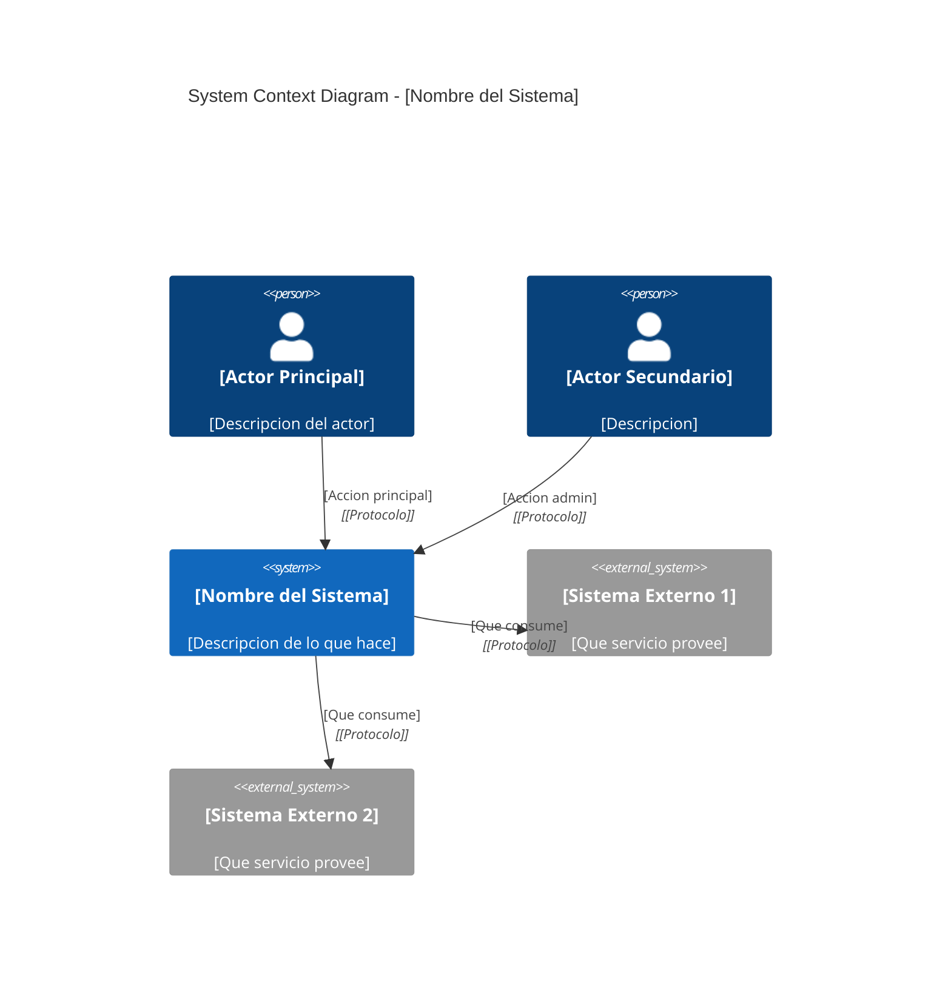
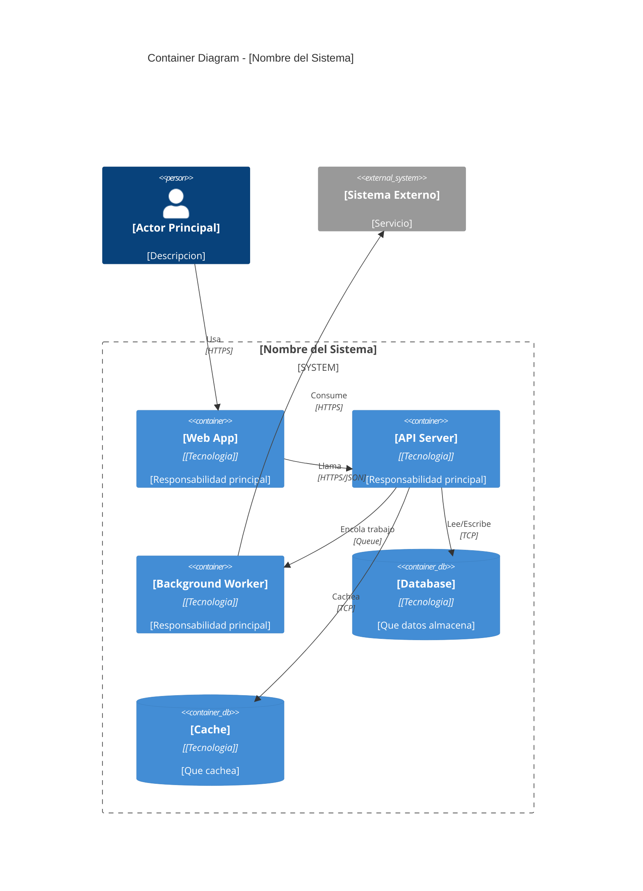
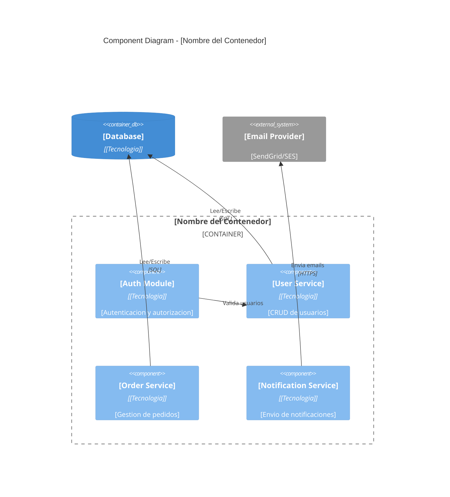

# C4 Model Templates (Mermaid)

Usa estas plantillas para generar diagramas C4 en Mermaid.
Rellena los placeholders `[...]` con informacion del proyecto.

---

## Level 1: System Context

Muestra el sistema en su entorno: actores y sistemas externos.

### Instrucciones Level 1:
- Incluir TODOS los actores humanos (roles distintos)
- Incluir TODOS los sistemas externos con los que se integra
- Las relaciones describen QUE hace, no COMO
- No incluir detalles tecnicos internos

---

## Level 2: Container Diagram

Muestra los contenedores tecnicos dentro del sistema.

### Instrucciones Level 2:
- Cada contenedor = un proceso desplegable independientemente
- Incluir tecnologia concreta (Next.js, FastAPI, PostgreSQL, Redis)
- Cada contenedor tiene UNA responsabilidad clara
- Bases de datos y caches son ContainerDb
- Relaciones incluyen protocolo de comunicacion

---

## Level 3: Component Diagram

Muestra componentes internos de UN contenedor. Solo necesario para contenedores complejos (>= 3 responsabilidades).

### Instrucciones Level 3:
- Solo diagramar si el contenedor tiene >= 3 componentes/modulos
- Un componente = un grupo logico de funcionalidad
- Mapea a modulos, servicios o clases principales del codigo
- NO diagramar contenedores simples (un CRUD basico no lo necesita)

---

## Cuando usar cada nivel

| Nivel | Siempre? | Audiencia | Detalle |
|-------|----------|-----------|---------|
| L1 Context | Si | Stakeholders, devs | Sistema como caja negra |
| L2 Container | Si | Devs, architects | Decisiones de tecnologia |
| L3 Component | Solo si >= 3 servicios | Devs implementando | Modulos internos |
| L4 Code | Nunca manual | -- | Se genera del codigo |

## Checklist

- [ ] L1: Todos los actores identificados?
- [ ] L1: Todos los sistemas externos listados?
- [ ] L2: Cada contenedor tiene tecnologia asignada?
- [ ] L2: Las relaciones incluyen protocolo?
- [ ] L3: Solo contenedores complejos diagramados?
- [ ] Nombres consistentes entre niveles?
