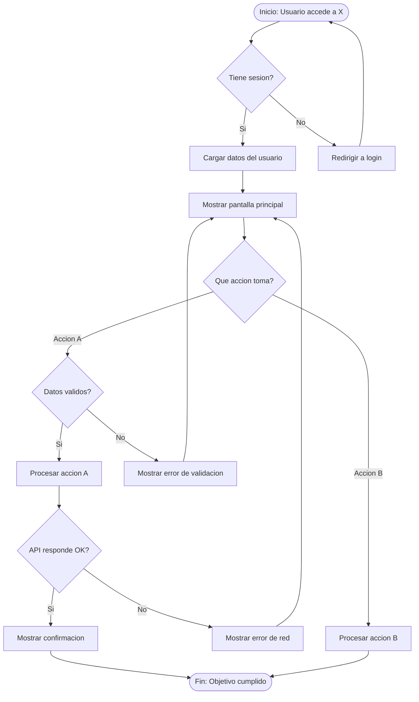

# User Flow: [Nombre del Flujo]

## Objetivo del Usuario

[Que quiere lograr el usuario con este flujo]

## Precondiciones

- [El usuario debe estar autenticado / no autenticado]
- [Datos necesarios previamente cargados]

## Diagrama de Flujo

## Mapping a Componentes UI

| Nodo del Flujo | Pantalla/Componente | Ruta |
|----------------|---------------------|------|
| DISPLAY | `PaginaPrincipal` | `/dashboard` |
| ACTION | `MenuAcciones` | -- |
| ERROR_A | `Toast / AlertDialog` | -- |
| SUCCESS_A | `ConfirmacionModal` | -- |

---

## 5 Preguntas Edge Case

Responder TODAS para cada flujo antes de implementar.

### 1. Datos vacios (Empty State)

**Pregunta**: Que ve el usuario la primera vez que entra, sin datos previos?

**Respuesta**: [Describir empty state: mensaje, ilustracion, CTA para crear primer item]

**Componente**: [Nombre del componente empty state]

### 2. Error de red (Network Error)

**Pregunta**: Que pasa si la API no responde, hay timeout, o devuelve 500?

**Respuesta**: [Describir: retry automatico? toast de error? fallback a cache? modo offline?]

**Componente**: [Nombre del componente de error]

### 3. Sin permisos (Authorization)

**Pregunta**: Que pasa si el usuario no tiene el rol necesario o su token expiro?

**Respuesta**: [Describir: redirigir a login? mostrar 403? ocultar acciones no permitidas?]

**Componente**: [Nombre del componente/guard de autorizacion]

### 4. Datos invalidos (Validation)

**Pregunta**: Que pasa con formato erroneo, limites excedidos, caracteres prohibidos?

**Respuesta**: [Describir: validacion inline? al submit? mensajes especificos por campo?]

**Componente**: [Nombre del componente de validacion]

### 5. Interrupcion (Interruption)

**Pregunta**: Que pasa si el usuario cierra la pestana, pierde conexion a mitad, o navega fuera?

**Respuesta**: [Describir: guardar draft? confirmar salida? recuperar estado al volver?]

**Componente**: [Nombre del componente de persistencia/recovery]

---

## Notas de Implementacion

- [Nota sobre dependencias entre flujos]
- [Nota sobre estados compartidos]
- [Nota sobre analytics/tracking en este flujo]
